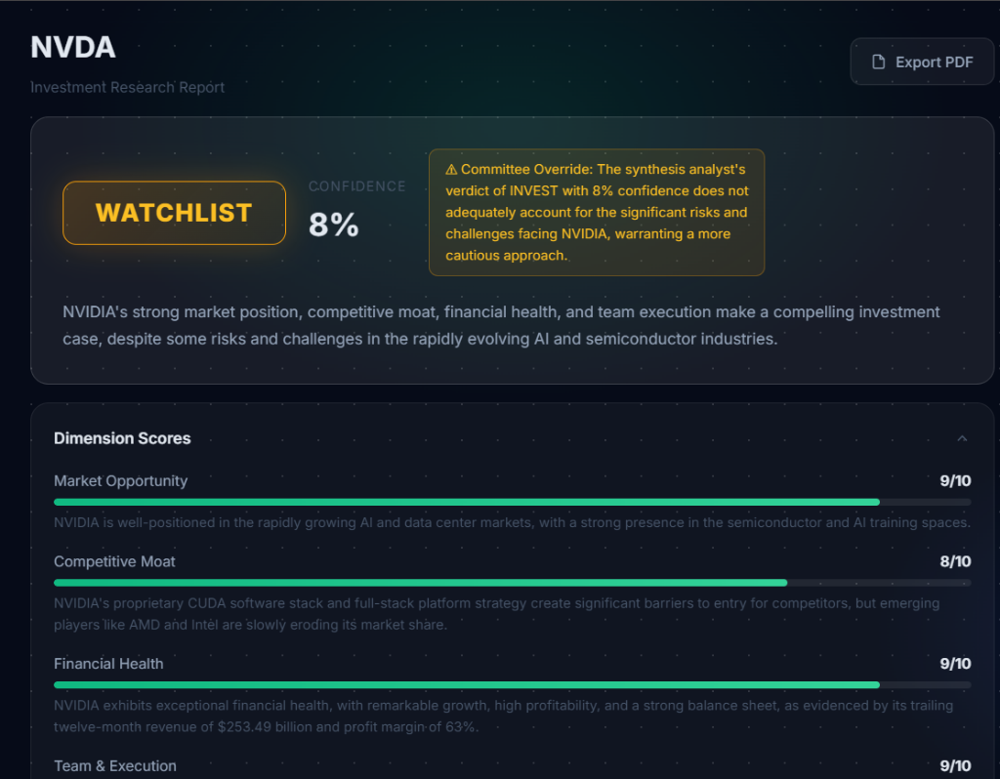
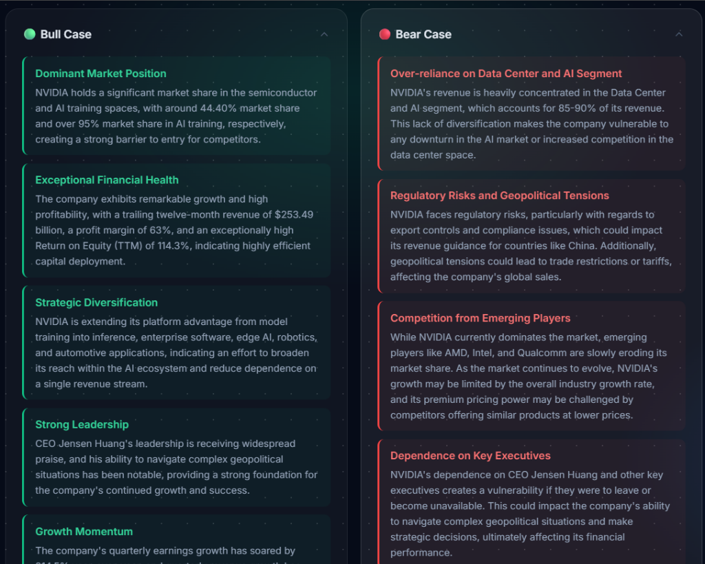
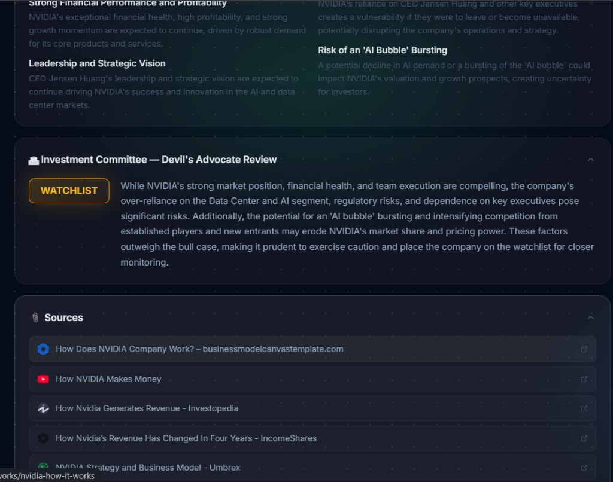

# FinSight AI: Autonomous Investment Research Agent

🚀 **Live Deployment:** [https://fin-sight-beta-pied.vercel.app/](https://fin-sight-beta-pied.vercel.app/)

## Overview — What it does
FinSight AI is a production-grade autonomous agent that acts as a senior financial analyst. It takes a company name as input, orchestrates a multi-agent workflow to conduct deep research (fetching hard financial metrics and scraping real-time news), synthesizes the findings, and delivers a final institutional-grade verdict: **INVEST**, **WATCHLIST**, or **PASS**, along with a detailed Devil's Advocate committee review.

## How to run it

### 1. Prerequisites
- Node.js (v18+)
- API Keys: Google AI Studio (Gemini), Groq, Alpha Vantage, and Tavily.

### 2. Setup
Clone the repository and install dependencies:
```bash
npm install
```

### 3. Environment Variables
Create a `.env.local` file in the root directory and add your API keys:
```env
GOOGLE_API_KEY=your_gemini_key
TAVILY_API_KEY=your_tavily_key
ALPHA_VANTAGE_API_KEY=your_alpha_vantage_key
GROQ_API_KEY=your_groq_key
```

### 4. Run the application
Start the Next.js development server:
```bash
npm run dev
```
Open [http://localhost:3000](http://localhost:3000) in your browser.

## How it works — Approach and Architecture
The application is built on a modern Next.js stack, using **LangGraph.js** to orchestrate the AI workflow.

**The Multi-Agent Graph Architecture:**
1. **Sequential Fan-Out:** The graph executes 5 core research nodes sequentially (Business Model, Financials, Competition, Leadership/News, Risk Factors). We specifically chose sequential execution to strictly adhere to token-per-minute (TPM) limits on free-tier LLM APIs, preventing rate-limit crashes.
2. **Specialized Tools:** 
   - `financialsNode` uses the **Alpha Vantage API** for perfectly structured, hallucination-free JSON quantitative data.
   - Other nodes use the **Tavily Search API** for real-time web scraping.
3. **Deep Synthesis:** The graph then generates a Bull Case, Bear Case, Moat Analysis, and Catalysts report.
4. **The Verdict:** Finally, the `synthesisNode` acts as the lead analyst, grading the company across 5 dimensions and outputting an INVEST/PASS verdict. This is immediately challenged by a `committeeNode` acting as a Devil's Advocate to ensure objectivity.

**The "Waterfall" LLM Fallback System:**
To guarantee 100% uptime, the `gemini.js` orchestrator utilizes a custom fallback wrapper. It attempts to use `gemini-2.5-flash` first. If Google imposes a rate-limit block, it seamlessly falls back to `gemini-1.5-flash` (larger quota), and if Google fails entirely, it instantly reroutes the request to Groq's open-source `llama-3.3-70b-versatile` model. 

## Key Decisions & Trade-offs
1. **LangGraph vs. standard LangChain:** I chose LangGraph for precise state management and node separation rather than a standard ReAct agent, as financial verdicts require highly structured, deterministic steps rather than open-ended agentic loops.
2. **Sequential vs. Parallel Execution:** While LangGraph excels at parallel node execution, I explicitly forced sequential edges. *Trade-off:* The report takes slightly longer to generate (60 seconds), but this ensures the application remains highly stable and crash-free on free-tier LLM API rate limits (12k TPM).
3. **Alpha Vantage vs. Web Scraping:** Financial numbers scraped from web articles are often hallucinated or outdated. I traded slightly higher API complexity to strictly fetch JSON metrics via Alpha Vantage, guaranteeing that P/E ratios and Market Caps are mathematically accurate. (Note: The agent uses a fast LLM call to resolve raw company names into valid ticker symbols automatically).
4. **Serverless State Management:** I chose to omit in-memory caching and rate-limiting from the Next.js API route. Because Vercel utilizes stateless Serverless functions, in-memory Maps do not persist reliably across requests or regions. For production rate-limiting, I would integrate Vercel KV or Upstash Redis.

## Example Runs

Here is an example of a complete, institutional-grade report generated for **NVIDIA (NVDA)**. The autonomous agent successfully evaluated the company's financial health, generated contrasting bull/bear arguments, and conducted a Devil's Advocate review.







## What I would improve with more time
- **Database Persistence:** I would add a PostgreSQL database (via Prisma) to cache finalized reports, saving API costs and providing users with a historical dashboard of their research.
- **Streaming Output:** While the UI receives node-by-node progress updates, I would implement token-by-token streaming via Server-Sent Events (SSE) within the markdown components to make the UI feel even faster.
- **Deeper Quantitative Agent:** I would introduce a Python-based sub-agent that executes a discounted cash flow (DCF) model based on historical SEC 10-K filings.
